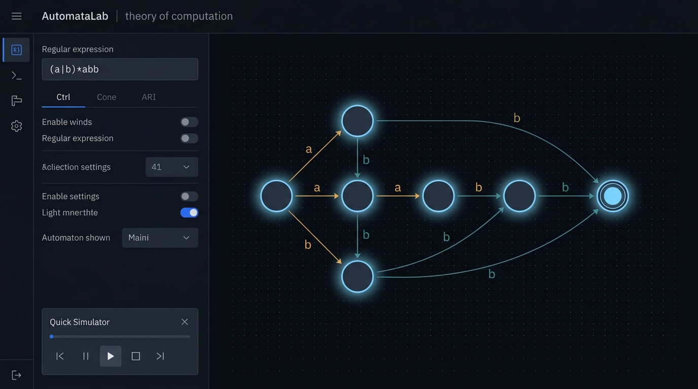
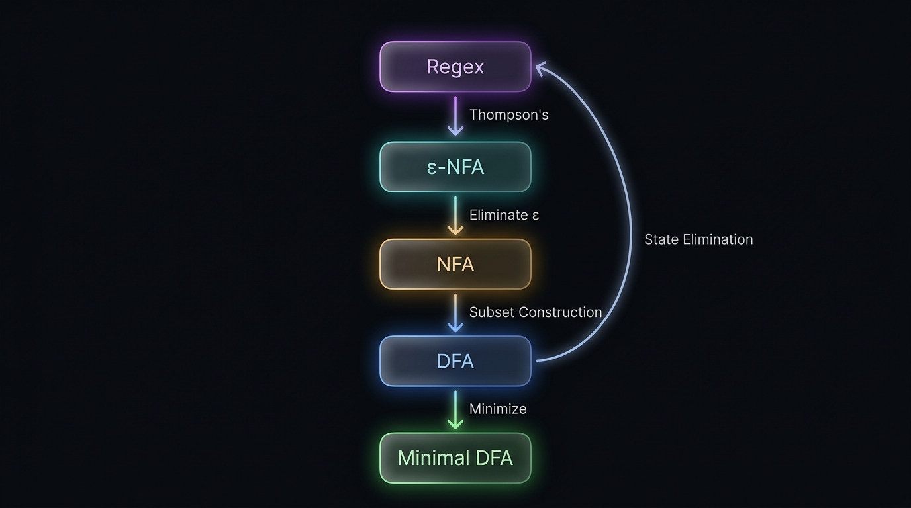

<div align="center">



<br/><br/>

# `AutomataLab`

**Regex &harr; &epsilon;-NFA &harr; NFA &harr; DFA &harr; Minimal DFA &mdash; full bidirectional pipeline, one workspace.**

[](https://automata-converter.vercel.app)&nbsp;
[](##-testing)&nbsp;
[](#-tech-stack)&nbsp;
[](#-license)

---

A node-based, non-destructive playground for the theory of computation &mdash;<br/>
build it by hand, generate it from a regex, or both.<br/>
**Compare everything. Trust nothing you can't verify.**

<br/>

[Features](#-features) &bull; [Quick Start](#-quick-start) &bull; [Pipeline](#-the-pipeline) &bull; [Architecture](#-architecture) &bull; [Testing](#-testing) &bull; [Roadmap](#-roadmap)

</div>

<br/>

## &diams; Why this exists

Most regex/automata converters are one-way, one-shot, and impossible to verify by eye. **AutomataLab** is different:

| | What | How |
|:--:|---|---|
| &#x1F504; | **Fully bidirectional** | Every classical conversion in the ToC toolkit is a pure, independently-tested function &mdash; not a black box. |
| &#x1F9EC; | **Non-destructive workspace** | Every conversion creates a *new* item with full lineage. Nothing is overwritten. Compare any two items for language equivalence, with a counterexample if they differ. |
| &#x1F52C; | **Provably correct** | Algorithms are hand-traced against textbook examples, round-tripped through an equivalence checker, and held in place by 159 automated tests. |
| &#x1F3AC; | **Live step-through** | DFA simulator traces each transition in real-time &mdash; glowing state node, color-coded active edge, consumed/remaining input visualization. |

---

## &#x2728; Features

<table>
<tr>
<td width="50%" valign="top">

### &#x1F9EE; Core Engine
- Custom regex lexer & recursive-descent parser
- Regex &rarr; &epsilon;-NFA via **Thompson's Construction**
- &epsilon;-NFA &rarr; NFA via **Epsilon Elimination**
- NFA &rarr; DFA via **Subset Construction**
- DFA &rarr; Minimal DFA via **Partition Refinement** (Hopcroft)
- Any automaton &rarr; Regex via **GNFA State Elimination**
- One-click **Regex &rarr; DFA** shortcut
- **DFA &rarr; NFA** relabeling for manual editing

</td>
<td width="50%" valign="top">

### &#x1F9E0; Verification & Simulation
- **DFA step-through simulator** with live node/edge highlighting
- NFA/&epsilon;-NFA accept/reject verdict via set-of-states simulation
- Product-automaton **equivalence checker**
- `true`/`false` result **+ counterexample string** on mismatch
- Explicit `&empty;` empty-language handling

### &#x1F5C2;&#xFE0F; Workspace
- Non-destructive pipeline &mdash; sources are never mutated
- Full **lineage tracking** across every transformation
- Side-by-side item comparison
- Strict validation &mdash; wrong type throws, never silently corrupts

</td>
</tr>
<tr>
<td width="50%" valign="top">

### &#x1F3A8; Canvas Editor
- Build automata by hand &mdash; add/rename/delete states & transitions
- Set start/accept states visually
- Save directly into the workspace
- Rollback-safe: a failed action never leaves a corrupted canvas

</td>
<td width="50%" valign="top">

### &#x1F4CA; Dual Visualization
- **Graph View** &mdash; interactive node diagram with color-coded edges
- **Table View** &mdash; transition table with symbol-colored columns
- **Alphabet legend** &mdash; deterministic color per symbol across all views
- Scrubbable **stage timeline** in the Converter &mdash; step through every intermediate automaton

</td>
</tr>
</table>

---

## &#x1F517; The Pipeline

<div align="center">



</div>

<br/>

<details>
<summary><strong>Text version (for screen readers & terminals)</strong></summary>

```
                    +-------------+
              +---->|   Regex     |<----+
              |     +------+------+     |
              |            | Thompson   |
      State   |            v            |  Regex->DFA
   Elimination|     +-------------+     |  (shortcut)
              |     |   e-NFA     |     |
              |     +------+------+     |
              |            | Epsilon    |
              |            | Elimination|
              |            v            |
              |     +-------------+     |
              |     |    NFA      |-----+---> relabel
              |     +------+------+     |
              |            | Subset     |
              |            | Construct. |
              |            v            |
              |     +-------------+     |
              +-----|    DFA      |-----+
                    +------+------+
                           | Minimize
                           v
                    +-------------+
                    | Minimal DFA |
                    +-------------+
```

</details>

Every arrow is a real, tested, independently-callable pure function &mdash; not a UI illusion.

---

## &#x1F3C1; Quick Start

```bash
# Clone
git clone https://github.com/prakhargit-04/automata-converter.git
cd automata-converter

# Install
npm install

# Run
npm run dev
```

Open **`http://localhost:5173`** and you're in.

### Try it in 60 seconds

| Step | Action |
|:--:|---|
| **1** | **Converter tab** &rarr; type `(a|b)*abb` |
| **2** | Watch the stage timeline: &epsilon;-NFA &rarr; NFA &rarr; DFA &rarr; Minimal DFA. Click any pill to inspect that stage's automaton. |
| **3** | Switch to **Canvas Editor** &rarr; build a DFA by hand &rarr; type a test string &rarr; hit **Run** &rarr; watch the simulator step through each state. |
| **4** | **Workspace** &rarr; select your original regex as **Item A** and the minimized DFA as **Item B** &rarr; **Verify Equivalence** &rarr; `true` &#x2705; |

---

## &#x1F3D7;&#xFE0F; Architecture

```
src/
|-- lib/
|   |-- types.ts                     # Automaton, Transition, EPSILON
|   |-- validator.ts                 # Structural validation
|   |-- alphabetColors.ts            # Deterministic symbol -> color mapping
|   |-- regex/
|   |   |-- lexer.ts                 # Tokenizer
|   |   +-- parser.ts                # Recursive-descent -> AST
|   +-- core/
|       |-- thompson.ts              # Regex AST -> e-NFA
|       |-- epsilonElimination.ts    # e-NFA -> NFA
|       |-- subsetConstruction.ts    # NFA -> DFA
|       |-- minimization.ts          # DFA -> Minimal DFA (Hopcroft)
|       |-- stateElimination.ts      # Automaton -> Regex (GNFA)
|       |-- primitives.ts            # move, epsilonClosure, completeDFA
|       |-- simulator.ts             # simulateNFA / simulateENFA
|       |-- equivalence.ts           # Product-automaton equivalence
|       |-- transitionTable.ts       # Pure table builder
|       |-- relabel.ts               # DFA -> NFA relabeling
|       |-- canvasAdapters.ts        # Canvas Editor <-> Automaton bridge
|       +-- workspace.ts             # Non-destructive workspace engine
|-- components/
|   |-- GraphView.tsx                # vis-network graph renderer
|   +-- TransitionTable.tsx          # Color-coded transition table
+-- tests/                           # 13 suites, 159 tests
```

### Design Invariants

> **&#x1F6E1;&#xFE0F; Core logic never imports React or vis-network.**
> The `lib/` tree is a pure TypeScript library. The UI is a rendering adapter only.

> **&#x1F504; Conversion functions never mutate their input.**
> Every algorithm returns a new `Automaton`. The workspace enforces lineage, not mutation.

> **&#x26A0;&#xFE0F; Invalid input produces an explicit error &mdash; never a silent no-op.**
> Validation is structural and exhaustive: missing start states, orphan transitions, type mismatches &mdash; all caught before they corrupt downstream output.

---

## &#x1F9EA; Testing

```bash
npm run build     # tsc -b && vite build  --  zero errors
npm run lint      # zero warnings
npm test          # 159/159 passing
```

<details>
<summary><strong>Full suite breakdown</strong></summary>

| Suite | What it proves |
|---|---|
| `thompson.test.ts` | Every regex operator produces a structurally correct &epsilon;-NFA |
| `epsilonElimination.test.ts` | Closure-to-accept-state edge cases (incl. bare `&epsilon;` regex) |
| `subsetConstruction.test.ts` | Determinization preserves language, even for ambiguous NFAs |
| `minimization.test.ts` | Partition refinement produces the unique minimal DFA |
| `stateElimination.test.ts` | Self-loop double-counting, parenthesization, empty-language sentinel |
| `equivalence.test.ts` | Regex round-trips preserve language across the full pipeline |
| `simulator.test.ts` | DFA/NFA/&epsilon;-NFA simulation matches textbook traces |
| `workspace.test.ts` | Original items are **never** mutated by downstream conversions |
| `canvasAdapters.test.ts` | Every canvas action either succeeds atomically or throws cleanly |
| `transitionTable.test.ts` | Incomplete DFAs render honestly &mdash; no fabricated transitions |
| `parser.test.ts` | Recursive-descent parser handles all operator precedences and edge cases |
| `validator.test.ts` | Structural validation catches every class of malformed automaton |
| `relabel.test.ts` | DFA &rarr; NFA relabeling preserves language and structure |

</details>

Every test asserts against **hand-traced textbook examples** &mdash; not just "it didn't throw."

---

## &#x1F6E0;&#xFE0F; Tech Stack

<div align="center">

| | Technology | Role |
|:--:|---|---|
| &#x269B;&#xFE0F; | **React 19** | UI framework |
| &#x1F4D8; | **TypeScript** (strict) | Type safety across the entire codebase |
| &#x26A1; | **Vite 8** | Build tooling & HMR |
| &#x1F578;&#xFE0F; | **vis-network** | Graph visualization (rendering adapter only) |
| &#x1F3A8; | **IBM Plex Mono + Inter** | Typography |
| &#x2601;&#xFE0F; | **Vercel** | Hosting & CI/CD |

</div>

---

## &#x1F5FA;&#xFE0F; Roadmap

- [x] Full bidirectional conversion pipeline
- [x] Product-automaton equivalence checker
- [x] Editable Canvas with rollback-safe actions
- [x] Non-destructive Workspace with lineage
- [x] Transition Table with color-coded symbols
- [x] Scrubbable stage timeline (Converter)
- [x] DFA step-through simulator with live node/edge glow
- [x] Alphabet color system (consistent across all views)
- [x] Live deployment on Vercel
- [ ] Delete workspace items (with lineage-aware cascade)
- [ ] Exam / challenge mode with hidden-reference verification
- [ ] Undo/redo history
- [ ] Export (PNG / SVG / JSON / LaTeX)

---

## &#x1F4C4; License

MIT &mdash; do whatever you want with it, just keep the license notice.

---

<div align="center">

**Built algorithm by algorithm, verified test by test.**

&#x2B50; Star this repo if it helped you understand automata theory a little better.

<br/>

<sub>Made with care by <a href="https://github.com/prakhargit-04">@prakhargit-04</a></sub>

</div>